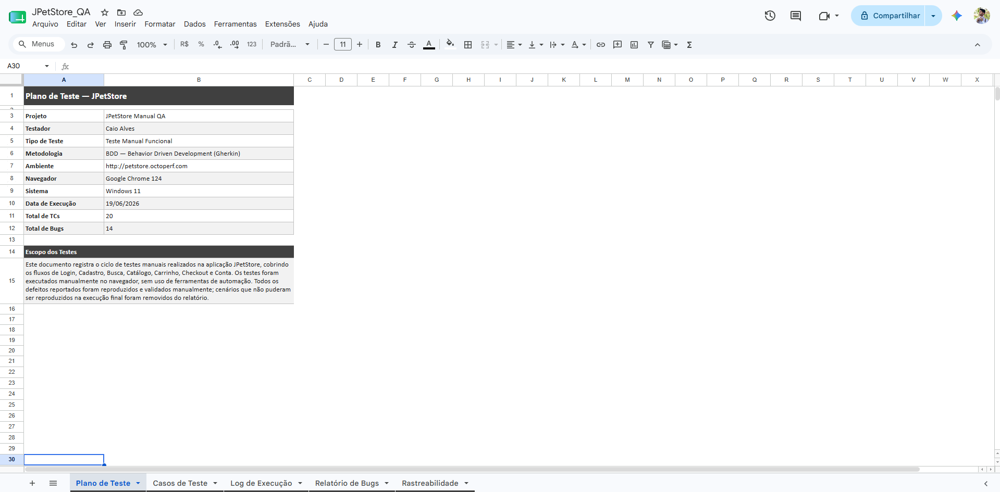
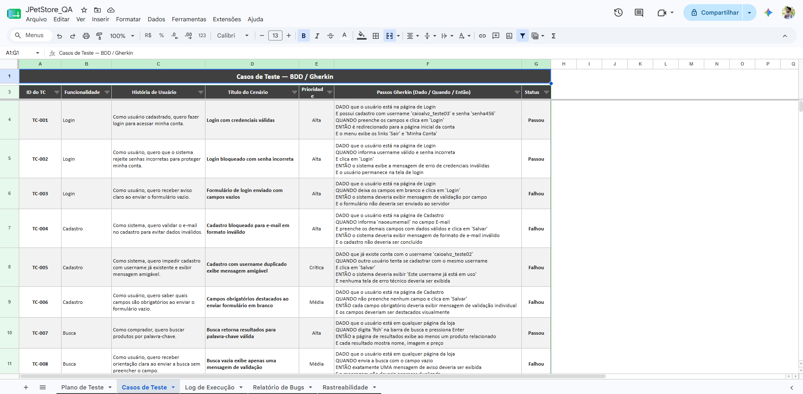
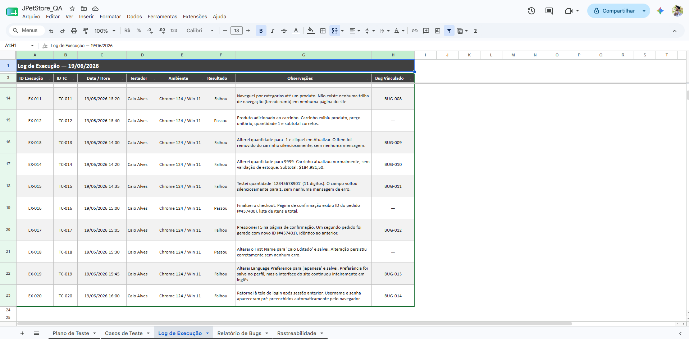
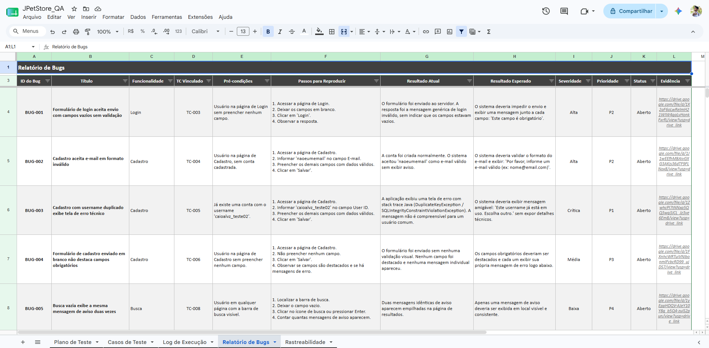
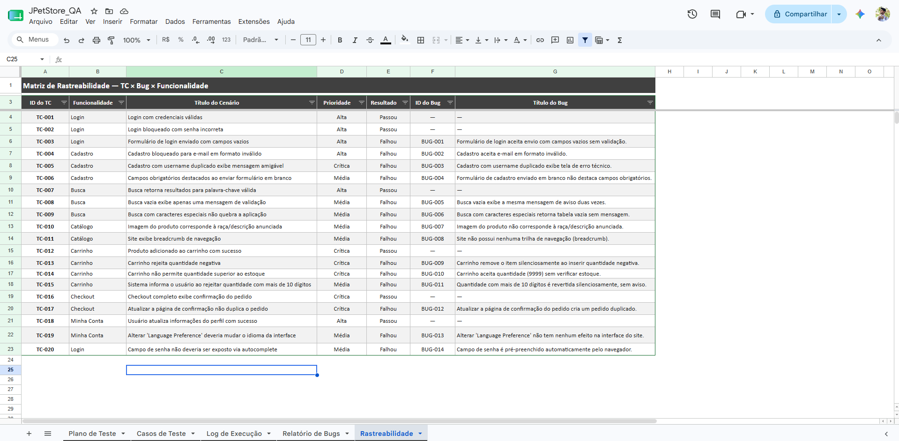

# JPetStore — Projeto de QA Manual e Documentação de Testes

**Caio C. S. Alves · Analista de QA**


---

## Visão Geral dos Artefatos

### Plano de Teste



### Casos de Teste



### Log de Execução



### Relatório de Bugs



### Matriz de Rastreabilidade



## Sobre o Projeto

Este repositório apresenta um projeto completo de **QA Manual** realizado na aplicação open source **JPetStore**, simulando um ciclo real de testes em um sistema de e-commerce.

O objetivo foi aplicar boas práticas de Qualidade de Software através da criação de artefatos amplamente utilizados em equipes de QA, incluindo:

* Plano de Testes
* Casos de Teste
* Execução de Testes
* Relatórios de Bugs
* Matriz de Rastreabilidade
* Cenários em BDD/Gherkin

O projeto demonstra minha capacidade de analisar requisitos, identificar defeitos, documentar evidências e garantir rastreabilidade entre funcionalidades, testes e bugs.

> **Ambiente de Teste:** JPetStore Demo Application · Google Chrome · Windows 11

---

## Visão Geral dos Resultados

| Métrica              | Total |
| -------------------- | ----- |
| Casos de Teste       | 20    |
| Execuções Realizadas | 20    |
| Bugs Reportados      | 14    |
| ✅ Aprovados          | 6     |
| ❌ Reprovados         | 14    |
| Taxa de Aprovação    | 30%   |

### Distribuição de Defeitos

| Severidade  | Quantidade |
| ----------- | ---------- |
| 🔴 Critical | 3          |
| 🟠 High     | 3          |
| 🟡 Medium   | 6          |
| 🟢 Low      | 2          |

---

## Escopo Testado

Durante o ciclo de testes foram avaliadas funcionalidades essenciais do sistema:

| Módulo          | Cobertura                       |
| --------------- | ------------------------------- |
| Login           | Autenticação e validações       |
| Registration    | Cadastro de usuários            |
| Product Search  | Busca de produtos               |
| Product Catalog | Navegação pelo catálogo         |
| Shopping Cart   | Inclusão e atualização de itens |
| Checkout        | Processo de compra              |
| My Account      | Gerenciamento de conta          |

---

## Principais Defeitos Encontrados

### 🔴 Duplicação de Pedidos

Ao atualizar a página após a confirmação da compra, o sistema gera um novo pedido.

**Impacto:**

* Cobrança duplicada
* Inconsistência de estoque
* Risco financeiro

---

### 🔴 Falha na Validação de Estoque

O sistema permite adicionar quantidades superiores ao estoque disponível.

**Impacto:**

* Overselling
* Divergência de inventário
* Problemas operacionais

---

### 🔴 Exposição de Erro Técnico

Ao tentar registrar um usuário já existente, a aplicação exibe informações técnicas ao usuário.

**Impacto:**

* Experiência negativa
* Possível exposição de informações internas

---

## Estrutura do Repositório

```text
jpetstore-qa-testing/
│
├── README.md
├── JPetStore_QA.xlsx
│
└── assets/
    ├── plano_de_teste.png
    ├── casos_de_teste.png
    ├── log_de_execucao.png
    ├── relatorio_de_bugs.png
    └── rastreabilidade.png
```

---

## Artefatos Disponíveis

### 📋 Plano de Teste

Define:

* Escopo
* Objetivos
* Estratégia de Teste
* Critérios de Entrada e Saída
* Ambiente de Teste

### 🧪 Casos de Teste

Contém:

* Cenários de teste
* Pré-condições
* Passos de execução
* Resultados esperados
* Prioridades

### ▶️ Log de Execução

Registra:

* Data da execução
* Resultado obtido
* Status do teste
* Evidências

### 🐛 Relatório de Bugs

Documentação completa dos defeitos encontrados:

* Passos para reprodução
* Resultado esperado
* Resultado obtido
* Severidade
* Prioridade

### 🔗 Matriz de Rastreabilidade

Relaciona:

```text
Requisito → Caso de Teste → Execução → Bug
```

Garantindo cobertura e rastreabilidade completa dos testes.

---

## Exemplo de Cenário BDD

```gherkin
Funcionalidade: Carrinho de Compras

Cenário: Atualizar quantidade de um item no carrinho

Dado que o usuário possui um produto adicionado ao carrinho
Quando o usuário altera a quantidade do produto
E clica em "Atualizar Carrinho"
Então o sistema deve recalcular o subtotal do item
E atualizar o valor total da compra corretamente
```

---

## Habilidades Demonstradas

### Quality Assurance

* Planejamento de Testes
* Testes Funcionais
* Testes Exploratórios
* Análise de Requisitos
* Gestão de Defeitos

### Documentação

* Test Plan
* Test Cases
* Bug Reports
* Traceability Matrix
* Test Execution Reports

### Metodologias

* BDD (Behavior Driven Development)
* Gherkin
* Boas práticas de QA

### Análise

* Priorização de Defeitos
* Classificação de Severidade
* Análise de Impacto no Negócio
* Rastreabilidade de Testes

---

## Diferenciais do Projeto

* Estrutura semelhante à utilizada em ambientes corporativos

* Casos de teste documentados profissionalmente

* Relatórios de bugs reproduzíveis

* Rastreabilidade completa entre artefatos

* Aplicação de BDD/Gherkin

* Demonstração prática das atividades de um QA Analyst

---

## Autor

**Caio C. S. Alves**

Analista de QA | Testes de Software | Garantia da Qualidade de Software

💼 LinkedIn: https://linkedin.com/in/caioalvz
📄Planilha completa: [Visualizar](https://docs.google.com/spreadsheets/d/11wIZYFAS1ygHVBTpNuSH46vi6ACpn0CVqMD4ctbh_44/edit?usp=sharing)

---

*"Qualidade nunca é um acidente; é sempre o resultado de um esforço inteligente." - John Ruskin*


